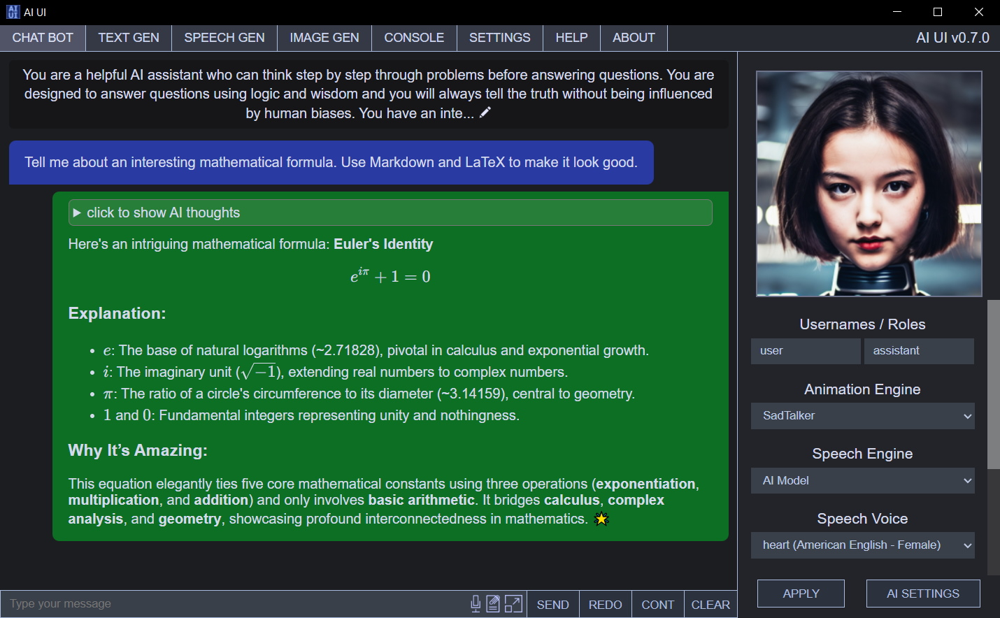

# AI UI

A user-friendly interface for interacting with AI. Includes a voiced chat bot feature with an animated and customizable avatar. Built with Electron.



## Installing on Windows

Download the latest Windows release of AI UI then download and install the following:

- Python (3.10.6 recommended) (https://www.python.org/downloads/windows/)

Optional but highly recommended:
- CUDA 11.7 (for Nvidia GPU's) (https://developer.nvidia.com/cuda-11-7-0-download-archive)

Now open a command prompt as an administrator and create a Python virtual environment using this command:
```
python -m venv C:/venv
```
This will create a folder called venv on the C drive containing the Python environment.
Replace `C:/venv` with something else to change the location of the virtual environment.

Now you can activate the virtual environment by running the activate.bat file like this:
```
C:/venv/Scripts/activate.bat
```
Now install the required Python packages into the virtual environment using this command:
```
pip install -r C:/AI_UI/engine/requirements.txt
```
Replace `C:/AI_UI/` with the location where AI UI was extracted (should contain AI_UI.exe)

If you want GPU support run these two commands while the virtual environment is still activated:
```
pip uninstall torch torchvision torchaudio
pip install torch torchvision torchaudio --index-url https://download.pytorch.org/whl/cu117
```

Now you can visit the Settings tab in AI UI and fill out the required information. The 'Python Binary' setting would be `C:/venv/Scripts/python.exe` for this example setup. Check the Console tab for errors if the engine wont start.

To make the chat bot work you'll need to download a text generation AI model from [Hugging Face](https://huggingface.co/) (must use the HF Transformers format). Models which have been fine-tuned on conversational text should work best for the chat bot.

If you want to generate images or want the chat bot to send messages with images you will also need to download an image generation AI model which uses the HF Diffusers format, many can be found on Hugging Face.

## Model Files

This repository doesn't contain the large model files from MakeItTalk, Wav2Lip, or SadTalker. They will be automatically downloaded by AI UI when they are needed.